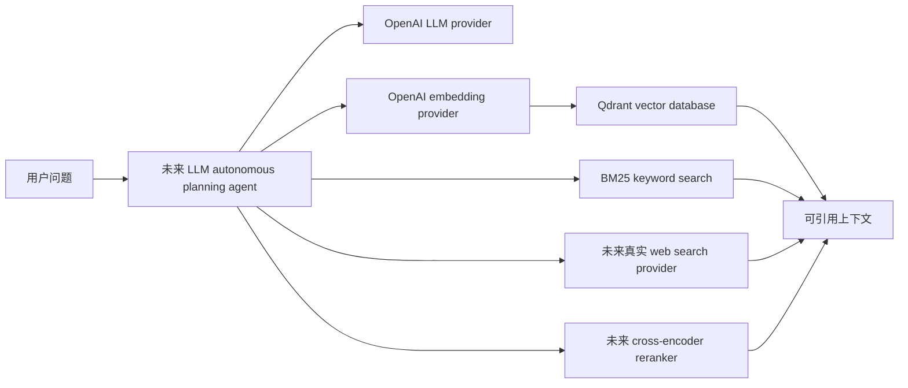

# KairoRAG

KairoRAG 已从离线 rule-based RAG demo 转向 cloud-native Agentic RAG 底座。阶段一重点是建立真实云服务主路径：OpenAI LLM、OpenAI embedding、Qdrant vector database、BM25 keyword search、未来真实 web search provider、未来 cross-encoder reranker，以及后续 LLM autonomous planning agent 的 provider 边界。

旧的 offline hashing embedding、pickle vector store、keyword overlap、rule-based planner、mock web search 和 deterministic answer generator 已经标记为 Legacy / Deprecated。它们仍保留给历史对照和离线测试，但新的 cloud runtime 不会默认 fallback 到这些旧实现；缺少云服务环境变量时会直接报出清晰错误。

## 架构方向



阶段一已经实现：

- `KairoCloudSettings`：统一读取 cloud runtime 环境变量。
- `validate_cloud_runtime()`：检查 OpenAI、Qdrant 和 web search provider 的关键配置。
- `OpenAILLMProvider`：使用官方 OpenAI Python SDK。
- `OpenAIEmbeddingProvider`：使用 `OPENAI_EMBEDDING_MODEL` 批量生成 embedding。
- `QdrantVectorStoreProvider`：支持 collection、upsert、search、delete、healthcheck 和基础 metadata filter。
- `BM25KeywordSearchProvider`：使用 `rank_bm25.BM25Okapi` 的真实 BM25 关键词检索。
- `WebSearchProvider`：保留 Tavily / SerpAPI / Bing 的配置骨架，不提供 mock fallback。
- `CrossEncoderRerankerProvider`：仅保留接口骨架，不伪造 cross-encoder 行为。

## 环境变量

cloud runtime 必须从环境变量读取密钥和 provider 配置，不要把密钥写入代码、测试或样例数据。

```bash
KAIRO_ENV=dev
LLM_PROVIDER=openai
OPENAI_API_KEY=...
OPENAI_CHAT_MODEL=gpt-4.1-mini
OPENAI_EMBEDDING_MODEL=text-embedding-3-small
VECTOR_STORE_PROVIDER=qdrant
QDRANT_URL=...
QDRANT_API_KEY=...
QDRANT_COLLECTION=kairo_chunks
WEB_SEARCH_PROVIDER=tavily
TAVILY_API_KEY=...
RERANKER_PROVIDER=bm25
MAX_SEARCH_RESULTS=10
MAX_CHUNKS_TO_READ=5
MAX_CONTEXT_TOKENS=6000
MAX_TOOL_CALLS=20
REQUEST_TIMEOUT_SECONDS=30
```

如果选择 `WEB_SEARCH_PROVIDER=serpapi`，需要提供 `SERPAPI_API_KEY`；如果选择 `WEB_SEARCH_PROVIDER=bing`，需要提供 `BING_API_KEY`。如果选择 `RERANKER_PROVIDER=cross_encoder`，阶段一会要求 `CROSS_ENCODER_MODEL`，但真实 cross-encoder 调用会留到后续阶段。

## 安装与测试

安装项目和开发依赖：

```bash
python -m pip install -e ".[dev]"
```

运行测试：

```bash
pytest
```

当前测试使用 fake client / mock client 验证 provider contract，不会调用真实 OpenAI、Qdrant 或外部搜索 API。

## Cloud Runtime 校验

可以直接校验 cloud 主路径配置：

```python
from kairorag.config import KairoCloudSettings, validate_cloud_runtime

settings = validate_cloud_runtime(KairoCloudSettings())
```

缺少 `OPENAI_API_KEY`、`QDRANT_URL`、`QDRANT_API_KEY` 或所选 web search provider 的 key 时，会抛出清晰的 `CloudRuntimeConfigurationError`，错误信息会列出缺失变量。

需要构建 provider 聚合对象时：

```python
from kairorag.cloud import build_cloud_runtime

runtime = build_cloud_runtime()
```

`build_cloud_runtime()` 会先校验配置，再构建真实 provider，不会静默切回 legacy 本地实现。

## Legacy 离线实现

以下旧模块仍存在，但已标记为 Legacy / Deprecated：

- `kairorag.indexing.embedding.HashingEmbeddingProvider`
- `kairorag.indexing.vector_store.VectorStore`
- `kairorag.indexing.keyword_index.KeywordIndex`
- `kairorag.agent.planner.plan_query`
- `kairorag.maintenance.web_search.search_web`
- `kairorag.agent.answer_generator.generate_answer`

说明见 [`kairorag/legacy/README.md`](kairorag/legacy/README.md)。旧 demo、旧评测和本地索引仍可用于历史对照，但不再代表 cloud 主路径。

## 后续阶段

阶段一刻意没有实现完整 LLM autonomous planning agent、真实 web search HTTP 调用、真实 cross-encoder rerank、完整 job freshness verification 云化，也没有删除旧本地模块。后续阶段会继续把 agent loop、web search、rerank、freshness verification 和 legacy 清理纳入真实云服务路径。
