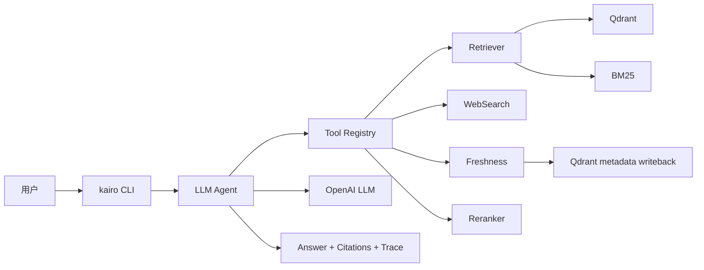

# KairoRAG

CI 状态：已提供 `.github/workflows/ci.yml`，仓库接入后可替换为正式 badge。

KairoRAG 是一个 cloud-native Agentic RAG system。当前主路径已经完全迁移到 cloud CLI / `kairo` 统一 CLI：OpenAI LLM、OpenAI embedding、Qdrant、BM25、Hybrid RRF、cloud reranker、真实 Web Search、Job Freshness Verification、Qdrant metadata 安全写回、observability 和离线 eval dashboard 都通过 cloud-native 入口运行。

旧 offline demo 与旧 pickle index 不再是支持入口。`kairorag.demos.run_single_query`、`kairorag.demos.run_batch_eval` 和 `kairorag.indexing.build_index` 仅保留废弃提示，不再执行旧 RAG 或生成 `keyword_index.pkl` / `vector_store.pkl`。

## 架构



## 快速开始

```bash
python -m pip install -e ".[dev,web]"
cp .env.example .env
docker compose up -d qdrant
kairo doctor
kairo index
kairo query "哪些岗位要求 RAG 和 LangGraph？"
kairo eval --suite all --fake-providers
```

没有安装 entry point 时也可以使用：

```bash
python -m kairorag.cli doctor
python -m kairorag.cli eval --suite all --fake-providers
```

## CLI

统一入口：

```bash
kairo --help
```

支持命令：

| 命令 | 作用 | 示例 |
| --- | --- | --- |
| `kairo index` | 构建 cloud index，写入 Qdrant 和 BM25 JSON | `kairo index --recreate --batch-size 64` |
| `kairo query` | 默认使用 CloudLLMAgent 查询 | `kairo query "你的问题" --include-trace` |
| `kairo agent` | 显式使用 LLM autonomous agent | `kairo agent "读取 chunk 后回答" --top-k 5` |
| `kairo verify` | 单独执行岗位 freshness verification | `kairo verify --company Kairo --title "RAG Engineer" --query "Kairo RAG Engineer"` |
| `kairo eval` | 生成离线 eval dashboard | `kairo eval --suite all --fake-providers` |
| `kairo doctor` | 检查生产化配置和依赖 | `kairo doctor --json` |
| `kairo config` | 打印脱敏配置摘要 | `kairo config --json --show-paths` |

兼容 cloud CLI 仍可用：

```bash
python -m kairorag.cloud.index
python -m kairorag.cloud.query_cli "你的问题"
python -m kairorag.cloud.agent.cli "你的问题"
```

## 环境变量

请从 `.env.example` 复制 `.env`，并只在本地或部署环境中填入真实 secret。README 和测试不会写入真实 key。

| 变量 | 说明 | 默认或示例 |
| --- | --- | --- |
| `KAIRO_ENV` | 运行环境 | `dev` |
| `LLM_PROVIDER` | LLM provider | `openai` |
| `OPENAI_API_KEY` | OpenAI key，本地填写 | 空 |
| `OPENAI_CHAT_MODEL` | Chat model | `gpt-4.1-mini` |
| `EMBEDDING_PROVIDER` | Embedding provider | `openai` |
| `OPENAI_EMBEDDING_MODEL` | Embedding model | `text-embedding-3-small` |
| `VECTOR_STORE_PROVIDER` | Vector store provider | `qdrant` |
| `QDRANT_URL` | Qdrant endpoint | `http://qdrant:6333` |
| `QDRANT_API_KEY` | Qdrant key，可为空 | 空 |
| `QDRANT_COLLECTION` | Collection 名称 | `kairo_chunks` |
| `KEYWORD_SEARCH_PROVIDER` | Keyword provider | `bm25` |
| `CLOUD_INDEX_MANIFEST_PATH` | manifest 输出路径 | `data/cloud_index_manifest.json` |
| `CLOUD_BM25_INDEX_PATH` | BM25 JSON 输出路径 | `data/cloud_bm25_index.json` |
| `WEB_SEARCH_PROVIDER` | Web search provider | `tavily` / `serpapi` / `bing` |
| `TAVILY_API_KEY` | Tavily key，本地填写 | 空 |
| `SERPAPI_API_KEY` | SerpAPI key，本地填写 | 空 |
| `BING_API_KEY` | Bing key，本地填写 | 空 |
| `RERANKER_PROVIDER` | Reranker provider | `base_score` / `cohere` / `jina` / `voyage` / `openai_listwise` / `cross_encoder` |
| `COHERE_API_KEY` | Cohere key，本地填写 | 空 |
| `JINA_API_KEY` | Jina key，本地填写 | 空 |
| `VOYAGE_API_KEY` | Voyage key，本地填写 | 空 |
| `QDRANT_METADATA_WRITE_ENABLED` | 是否允许真实 metadata 写回 | `false` |
| `QDRANT_METADATA_WRITE_DRY_RUN` | metadata 写回默认 dry-run | `true` |
| `FRESHNESS_AUDIT_LOG_PATH` | audit JSONL 路径 | `data/freshness_audit.jsonl` |
| `TRACE_LOG_PATH` | trace JSONL 路径 | `data/trace_events.jsonl` |

## Guardrails

- 不读 chunk 不回答。
- citations 只能来自已经 `chunk_read` 的 chunks。
- search snippet 只是网页线索，不是最终证据。
- freshness 未验证时，不声称岗位实时 `active` 或仍开放。
- `closed` 岗位不能推荐为当前可申请岗位。
- Qdrant metadata 写回默认 dry-run，只有显式授权且配置开启才会真实写回。
- trace、audit、doctor、config 输出都会进行 secret redaction。
- cloud 主路径不会 fallback 到 legacy ReactAgent、legacy planner、mock web search、deterministic answer generator、pickle VectorStore 或 hashing embedding。

## Eval Dashboard

运行：

```bash
kairo eval --suite all --fake-providers --output-dir results/eval_dashboard
```

输出文件：

- `eval_results.json`
- `eval_report.md`
- `eval_dashboard.html`

支持 suite：

| Suite | 指标 |
| --- | --- |
| `retrieval` | `retrieval_hit_rate`、`evidence_recall`、`mrr`、`nDCG@5`、`read_chunk_recall`、`context_token_usage` |
| `groundedness` | `citation_validity`、`invalid_citation_rate`、`no_evidence_refusal_rate`、`snippet_leakage_rate` |
| `agent` | `planning_success_rate`、`invalid_tool_call_rate`、`tool_budget_exceeded_rate`、`chunk_read_before_answer_rate`、`final_answer_from_grounded_generator_rate` |
| `freshness` | `verification_accuracy`、`active_precision`、`closed_recall`、`stale_detection_rate`、`false_active_rate` |
| `reranker` | `rerank_improvement_rate`、`rerank_mrr_delta`、`rerank_latency_ms`、`empty_rerank_rate` |
| `writeback` | `unauthorized_apply_block_rate`、`dry_run_default_rate`、`allowed_field_violation_rate`、`audit_log_created_rate` |

默认使用 fake providers 和 fixture 数据，不调用 OpenAI、Qdrant、Tavily、SerpAPI、Bing、Cohere、Jina、Voyage 或任何外部服务。

## Doctor

运行：

```bash
kairo doctor
kairo doctor --json
kairo doctor --check qdrant
```

检查内容：

- config：必需环境变量、provider 名称、疑似硬编码 secret。
- paths：manifest、BM25 index、audit log 目录、trace log 目录。
- qdrant：离线检查 URL / collection；`--live` 时才做 healthcheck。
- openai：检查 key 和模型名；默认不发起付费 LLM 请求。
- websearch：检查 provider key；默认不发起外部搜索。
- reranker：检查 provider key 或本地模型配置；默认不调用外部 rerank 服务。
- legacy：扫描 cloud 主路径是否仍引用 legacy module。

## Observability

- `TRACE_LOG_PATH` 写入 JSONL trace event。
- `FRESHNESS_AUDIT_LOG_PATH` 写入 freshness writeback audit JSONL。
- `--trace-output` 可保存单次 query 或 agent run 的 trace JSON。
- 所有 trace/audit/config/doctor 输出都会隐藏 secret 字段和疑似 secret 值。

## CI

GitHub Actions workflow 位于 `.github/workflows/ci.yml`，包含：

- checkout
- setup-python
- install dependencies
- `ruff check`
- secret scan
- import smoke test
- CLI help smoke test
- `python -m pytest`

CI 不需要真实云服务 key，live tests 默认不运行。

## Docker 与 Compose

构建镜像：

```bash
docker build -t kairorag .
```

启动 Qdrant：

```bash
docker compose up -d qdrant
```

运行 app doctor：

```bash
docker compose run --rm app kairo doctor
```

Makefile 命令：

```bash
make install
make test
make lint
make ci
make index
make query
make doctor
make eval
make docker-build
make docker-up
make docker-down
```

## Legacy 状态

已废弃入口：

- `python -m kairorag.demos.run_single_query`
- `python -m kairorag.demos.run_batch_eval`
- `python -m kairorag.indexing.build_index`
- `python -m kairorag.scripts.build_index`

这些入口只打印迁移提示并以退出码 2 结束。旧本地 `KeywordIndex`、`VectorStore`、`HashingEmbeddingProvider`、legacy `ReactAgent`、legacy `job_verifier` 和 mock web search 仍保留为历史参考，但不属于主路径。

## 测试

```bash
python -m pytest
```

本地 CI 流程：

```bash
python -m ruff check .
python -m pytest
python -m kairorag.cli --help
python -m kairorag.cli eval --suite all --fake-providers
```

## 后续改进

- 第 7 阶段可继续完善多环境 deployment 策略。
- 增强权限系统和 metadata 写回审批模型。
- 扩充真实业务 eval 数据集和回归阈值。
- 增加可交互 UI dashboard。
- 增加更细粒度的 live provider contract test，默认仍保持跳过。
