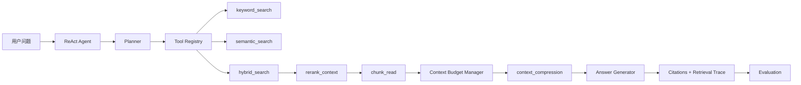
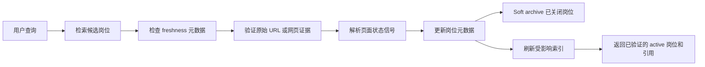

# KairoRAG：Agentic Knowledge Retrieval System

## 项目概述

KairoRAG 是一个面向企业知识库的 Agentic RAG 检索、评测与动态维护系统。它围绕 JD、简历、公司资料和面试材料构建，采用后端优先的实现方式，在不依赖付费 API 的前提下即可本地运行。

这个项目重点展示面向真实工程场景的 RAG 能力：文档加载、切分、关键词索引、语义索引、混合检索、chunk 级证据引用、上下文预算控制、检索轨迹记录、确定性 RAG 评测，以及岗位 freshness 验证与知识库维护。

## 为什么是 Agentic RAG

普通 top-k RAG：

```text
question -> vector search top-k -> 把 chunks 塞进 prompt -> answer
```

KairoRAG：

```text
question -> Agent 规划检索路径
  -> keyword_search / semantic_search / hybrid_search
  -> rerank
  -> chunk_read
  -> context budget
  -> 保留 citation 的上下文压缩
  -> 基于证据生成答案
  -> eval
  -> 需要时验证并更新知识库
```

关键区别在于：搜索结果里的 snippet 只是线索，不是最终证据。最终回答必须建立在 `chunk_read` 读到的内容，或保留原始 `chunk_id` 的压缩证据块之上。

## 核心特性

- 分层检索工具：提供 `keyword_search`、`semantic_search`、`hybrid_search` 和 `chunk_read`。
- Agentic 检索规划：planner 会根据精确术语、语义意图和 freshness 需求决定检索路径。
- 混合检索：通过 reciprocal rank fusion 组合关键词检索和本地向量检索。
- Chunk 级证据引用：每条回答引用都包含支持它的 `chunk_id`。
- 上下文预算控制：限制搜索结果数、读取 chunk 数、上下文 token 数和工具调用次数。
- 检索轨迹记录：planner、search、rerank、read、compress 的每一步都会被记录。
- RAG 评测：提供确定性的 retrieval hit rate、evidence recall、groundedness、skill F1、token usage 和 tool-call 指标。
- 动态知识库维护：支持岗位验证、stale 检测、soft archive、audit log、去重和索引刷新。
- Mock 优先的外部接口：网页搜索和页面解析支持 `mock://` 证据，离线也能跑通。

## 系统架构



动态维护流程：



## 数据来源

- `data/raw/jobs.csv`：mock 岗位知识库，覆盖 active、closed、stale、unknown 和 duplicate 状态。
- `data/raw/resume.md`：包含 `akashic-agent` 经验的候选人简历。
- `data/raw/company_docs/`：公司资料 markdown。
- `data/raw/interview_notes/`：面试准备笔记。
- `data/eval/qa_eval.json`：RAG 问答评测集。
- `data/eval/job_verification_eval.json`：岗位验证评测集。

## 快速开始

如需可编辑安装：

```bash
python -m pip install -e .
```

构建索引：

```bash
python -m kairorag.indexing.build_index --input data/raw --output data/indexes
```

运行单条查询：

```bash
python -m kairorag.demos.run_single_query \
  --question "哪些岗位要求 RAG、LangGraph 或多 Agent 编排经验？"
```

查询并验证岗位状态：

```bash
python -m kairorag.demos.run_single_query \
  --question "只返回目前仍在招聘、并且要求 RAG 或多 Agent 编排经验的岗位" \
  --verify-jobs
```

运行 RAG 评测：

```bash
python -m kairorag.demos.run_batch_eval \
  --eval-file data/eval/qa_eval.json \
  --output results/eval_report.json
```

运行岗位验证评测：

```bash
python -m kairorag.demos.run_batch_eval \
  --eval-file data/eval/job_verification_eval.json \
  --output results/job_verification_eval_report.json \
  --job-verification --mock-web
```

批量验证岗位：

```bash
python -m kairorag.maintenance.job_verifier \
  --jobs-file data/raw/jobs.csv \
  --status unknown,stale \
  --limit 5
```

## 示例问题

1. 哪些岗位要求 RAG 或知识库问答经验？
2. 哪些岗位更看重 LangGraph / 多 Agent 编排？
3. 我的 akashic-agent 项目能匹配哪些 JD 要求？
4. 我还缺哪些技能点？
5. 只返回目前仍在招聘、并且要求 RAG 或多 Agent 编排经验的岗位。

## 评测指标

KairoRAG 使用确定性指标，因此无需 LLM judge 也能运行：

- `retrieval_hit_rate`：gold chunk 是否至少有一个出现在 search results 或 read chunks 中。
- `evidence_recall`：`chunk_read` 覆盖了多少 gold chunks。
- `groundedness_score`：citations 是否来自 read chunks，且是否覆盖 gold 证据。
- `skill_extraction_f1`：预测技能与期望技能的匹配程度。
- `context_token_usage`：读取证据后的上下文 token 估计值。
- `tool_call_count`：检索与验证动作的调用次数。
- `verification_accuracy`：岗位状态判断准确率。
- `active_precision`：active 岗位预测精度。
- `closed_recall`：closed 岗位召回率。
- `evidence_domain_match`：证据来源是否符合预期的 mock/web 域。

## 动态知识库维护

企业知识库会过期：岗位会关闭、换链接、跨平台重复发布，或者变成无法确认的 stale 状态。KairoRAG 通过基于证据的维护流程处理这些问题：

- `active`：当前页面或搜索证据显示仍可申请。
- `closed`：可靠页面证据显示岗位已关闭或已招满。
- `stale`：证据不足，因此系统明确标记为“不确定”。
- `updated`：旧链接失效，但搜索发现了新的 active 岗位页。
- `duplicate`：该记录指向主记录，默认检索时不返回。

Closed 和 duplicate 岗位不会被物理删除，只会 soft archive 或标记为 inactive，然后从默认检索中排除。更新流程支持 dry-run，也支持通过 `--apply-updates` 实际写回；只有实际写回时才会把记录追加到 `data/maintenance/audit_log.jsonl`。

当前索引刷新器采用 fallback rebuild 策略，先保证行为正确，再把真正的增量刷新留给后续优化。
